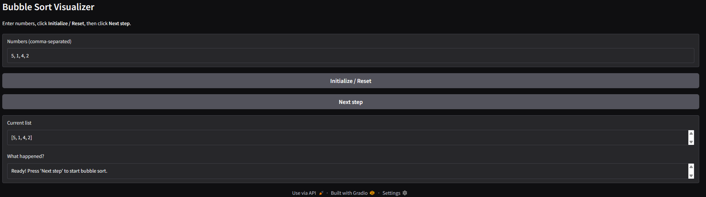
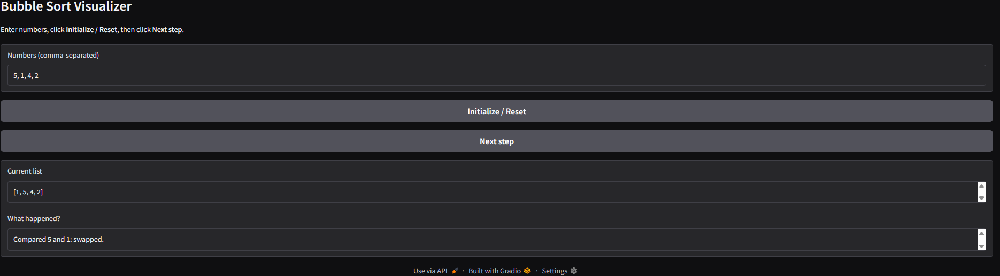
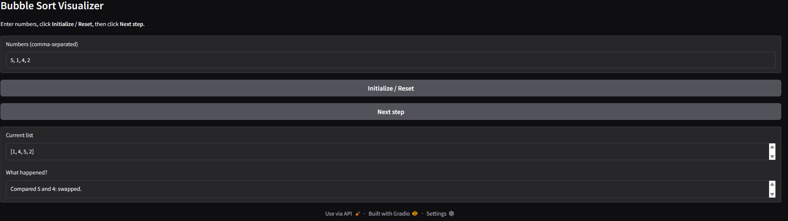
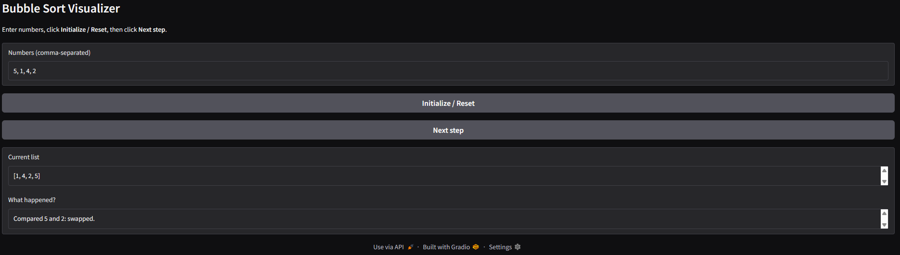
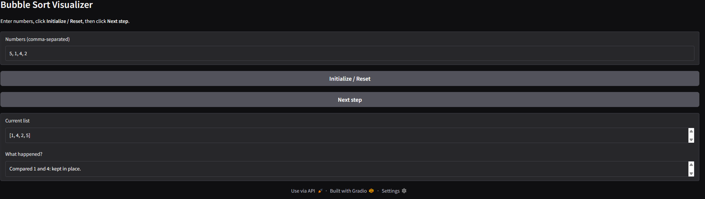
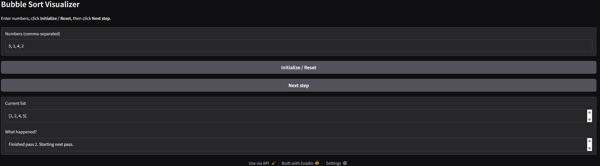
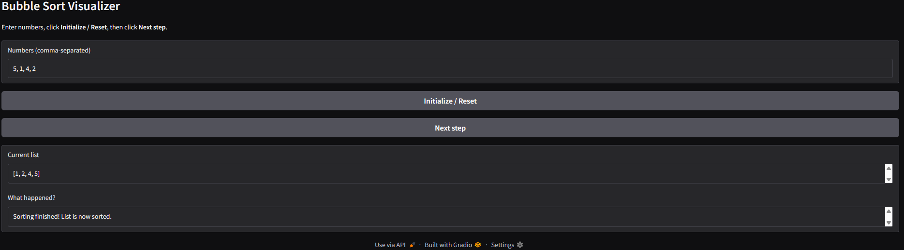
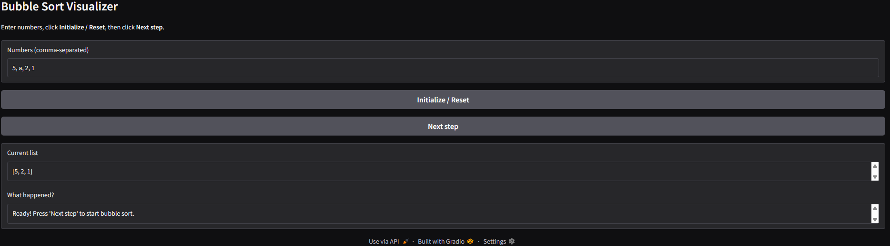
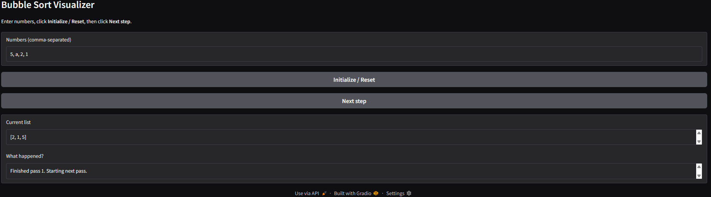
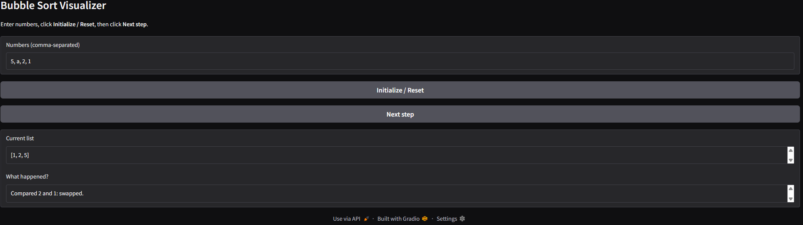

# Bubble sort diagram (Gradio)

## Project Overview

An interactive web application which educates on the way Bubble Sort works in steps.  
It is developed on Gradio and it uses session state to remember in which point of the algorithm you are after clicking one of the buttons rather than restarting each time.

---

## Algorithm and Computational Thinking.

Selected Algorithm Bubble Sort.

I selected Bubble Sort since it is straightforward, easy to understand, and easy to imagine in the form of comparisons and swaps.  
It is effective with the button-based interface, where a single click takes one step of the algorithm.

### Decomposition

I divided the problem into four key components: reading and parsing the input of the user, initializing the state of the sorting process, and carrying out one step of a Bubble Sort each time the user clicked on a button and providing feedback to the user.  
By splitting these functions apart the code becomes less complex to read, and the interface is able to perform a single understandable action at a time.

### Pattern Recognition

Bubble Sort will always have the same steps of comparing neighbouring items, swapping them whenever they are out of order, and repeating the process a few times through the list.  
This pattern is also important to organize the app in such a way that the successive clicks of the Next step buttons would only replicate this very process on the next two or the next round.

### Abstraction

To maintain the simplicity, the app will merely display the list at hand and a brief description of what has occurred to the steps including what numbers were compared and whether they were switched.  
Information such as loop indexes, internal variables and Python syntax are not visible and therefore the user concentrates on the concept of Bubble Sort as opposed to the implementation itself.

### Algorithm Design Input - Process - Output.

It takes the form of a text box in which the user inputs comma-separated integers e.g. 5, 1, 4, 2.  
This string is broken down into a list of integers and the result is stored and changed to a state of Bubble Sort (the list, indices, and sorted flag) using gr.State object with each button press.  
The current list and a short message describing what the most recent step of the algorithm was are the output.

---

## Gradio App Design

The app consists of Gradio Blocks input text box, two buttons, one to initialize / reset and the other to next step, and two read-only text boxes that contain the current list and explanation.  
A gr.State component is a dictionary containing such fields as arr, i, j, n, and sorted, and the state is inputted and outputted of the step function to allow the app to remember where it was between the button presses.

## How to Run Locally

1. Install Python 3 (e.g., 3.12).
2. Clone or download this repository.
3. Install dependencies:

   ```bash
   pip install requirements.txt.

---

## Hugging Face Link

https://huggingface.co/spaces/vaibhav3146/bubblesort-visualizer-vaibhav

---

## Testing & Verification

### Test Case 1










### Test Case 2


### Test Case 3








---

# Files in This Repository

1. app.py - Main application with gradio consisting of Bubble Sort logic.
2. README.md - documentation file (you are on it right now)
3. requirements.txt - All required dependencies

---

# Author and Acknowledgment

## Final Project: Gradio Algorithm - Bubble Sort
### Name: Vaibhav Arora
### Student ID: 20473293
### Course: CISC121

---

# AI Disclaimer

The project was done with the help of generative AI at AI Level 4, according to the guidelines of the course. I established ChatGPT to assist in idea generation, descriptions of Gradio State, and README text draft. All AI-assisted information was reviewed, edited, and tested by me to make sure I am familiar with the algorithm, the code is functioning as I wished, and that the end product is a demonstration of my personal learning.
